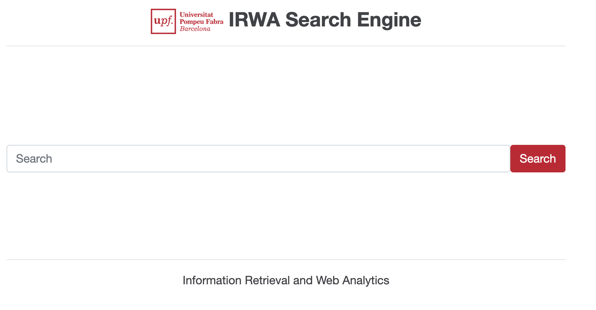

# Information Retrieval and Web Analytics (IRWA) 

<table>
  <tr>
    <td style="vertical-align: top;">
      
    </td>
    <td style="vertical-align: top;">
      This repository contains the code for the IRWA Final Project - Search Engine with Web Analytics of G011.
      The project is implemented using Python and the Flask web framework. It includes a simple web application that allows users to search through a collection of documents and view analytics about their searches.
    </td>
  </tr>
</table>

----
## Project Structure

```
/irwa-search-engine
├── data                 # Contains the dataset file (fashion_products_dataset.json)
├── irwa_venv            # Environment variables for configuration (e.g., API keys)
├── myapp                # Contains the main application logic
├── project_progress     # Contains your solutions for Parts 1, 2, and 3 of the project
├── static               # Contains static assets (images, CSS, JavaScript)
├── templates            # Contains HTML templates for the Flask application
├── .gitignore           # Specifies files and directories to be ignored by Git
├── LICENSE              # License information for the project
├── README.md            # Project documentation and usage instructions
├── requirements.txt     # Lists Python package dependencies
└──  web_app.py          # Main Flask application
```


----
## Overview
This project is part of the IRWA (Information Retrieval and Web Analytics) course and aims to develop a search engine over an e-commerce product catalog.
It is structured in three main parts:

# Part 1 – Data Preprocessing
- Cleaning and normalizing textual, categorical, and numerical fields.
- Implementing preprocessing functions (setup_preprocessing_tools, preprocess_text, clean_categorical, clean_numeric).
- Handling product details and unifying descriptive fields.

# Part 2 – Exploratory Data Analysis (EDA)

- Exploring dataset statistics and content distribution.
- Analyzing brands, sellers, and titles.
- Visualizing top brands and sellers.
- Generating word clouds and analyzing frequent words.

----
## Installation Instructions

# 1. Clone repository
```
git clone <repository-url>
cd irwa_search_engine_G_011
```

# 2. Create a virtual environment
```
python3 -m venv irwa_venv
source irwa_venv/bin/activate  # macOS/Linux
irwa_venv\Scripts\activate     # Windows
```
# 3. Install dependencies
```
pip install -r requirements.txt
```

----
## How to Run
# Part 1 - Data preprocessing
1. Open project_progress/part_1/Part_1.ipynb in Jupyter Notebook or VS Code.
2. Run all cells sequentially.
3. The notebook:
- Loads and cleans the dataset.
- Processes text, categorical, and numeric fields.
- Outputs a cleaned dataset ready for EDA.

# Part 2 – Exploratory Data Analysis
1. Open project_progress/part_2/Part_2.ipynb.
2. Run all cells to reproduce plots and statistics:
- Brand and seller frequency plots.
- Vocabulary and token distribution.
- Example visualizations (e.g., word clouds).
3. The results should match those described in Part_2.pdf.

----
## Key Functions
setup_processing_tools()                    #Initializes stemmer and stopword list. 
preprocess_text(text, stemmer, stop_words)  #Tokenizes, cleans, removes, and steams text
clean_categorical(value)                    #Normalizes categorical attributes (e.g., brand, category).
clean_numefic(value, value_type)            #Cleans and converts numerical fields. 
extract_product_details()                   #Processes products attribute list, excluding uninformative fields

---- 
## Results 
- Cleaned and standardized dataset with consistent text representation.
- EDA of cleaned dataset. 

---- 
## Reproducibility
- All code can be run sequentially in the provided .ipynb files


