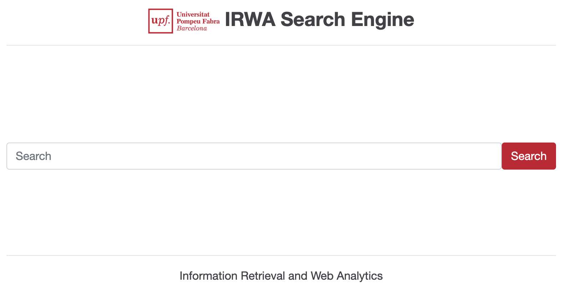

# Information Retrieval and Web Analytics (IRWA) 

<table>
  <tr>
    <td style="vertical-align: top;">
      
    </td>
    <td style="vertical-align: top;">
      This repository contains the code for the IRWA Final Project - Search Engine with Web Analytics of G011.
      The project is implemented using Python and the Flask web framework. It includes a simple web application that allows users to search through a collection of documents and view analytics about their searches.
    </td>
  </tr>
</table>

----
## Project Structure

```
/irwa_search_engine_G_011
├── data                 # Contains the dataset file (fashion_products_dataset.json)
├── irwa_venv            # Environment variables for configuration (e.g., API keys)
├── myapp                # Contains the main application logic
├── project_progress     # Contains your solutions for Parts 1, 2, and 3 of the project
├── static               # Contains static assets (images, CSS, JavaScript)
├── templates            # Contains HTML templates for the Flask application
├── .gitignore           # Specifies files and directories to be ignored by Git
├── LICENSE              # License information for the project
├── README.md            # Project documentation and usage instructions
├── requirements.txt     # Lists Python package dependencies
└──  web_app.py          # Main Flask application
```


----
# Overview
This project is part of the IRWA (Information Retrieval and Web Analytics) course and aims to develop a search engine over an e-commerce product catalog.
It is structured in three main parts:

## Part 1 – Data Preprocessing and Exploratory Data Analysis (EDA)
- Cleaning and normalizing textual, categorical, and numerical fields.
- Implementing preprocessing functions (setup_preprocessing_tools, preprocess_text, clean_categorical, clean_numeric).
- Handling product details and unifying descriptive fields.
- Exploring dataset statistics and content distribution.
- Analyzing brands, sellers, and titles.
- Visualizing top brands and sellers.
- Generating word clouds and analyzing frequent words.

## Part 2 - Indexing, Ranking and Evaluation
- Built an inverted index and stored it as a JSON file.
- Defined five custom test queries based on frequent dataset terms.
- Implemented TF-IDF scoring and cosine similarity for document ranking.
- Computed document-level TF-IDF vectors with L2-normalization.
- Applied evaluation metrics (P@K, R@K, AP@K, F1, MAP, MRR, NDCG and PR curves).
- Validated results using predefined queries and relevance labels.
- Analyzed system performance and proposed improvements. 

----
# Installation Instructions

## 1. Clone repository
```
git clone <repository-url>
cd irwa_search_engine_G_011
```

## 2. Create a virtual environment
```
python3 -m venv irwa_venv
source irwa_venv/bin/activate  # macOS/Linux
irwa_venv\Scripts\activate     # Windows
```
## 3. Install dependencies
```
pip install -r requirements.txt
```

----
# How to Run
## Part 1.1 - Data preprocessing
1. Open project_progress/part_1/Part_1.ipynb in Jupyter Notebook or VS Code.
2. Run all cells sequentially.
3. The notebook:
- Loads and cleans the dataset.
- Processes text, categorical, and numeric fields.
- Outputs a cleaned dataset ready for EDA.

## Part 1.2 – Exploratory Data Analysis
1. Open project_progress/part_1/Part_1.ipynb.
2. Run all cells to reproduce plots and statistics:
- Brand and seller frequency plots.
- Vocabulary and token distribution.
- Example visualizations (e.g., word clouds).

## Part 2 - Indexing, Ranking and Evaluation
1. Open project_progress/part_2/Part_1.ipynb
2. Run all cells sequentially. It should
- Build the inverted-index
- Create 5 custom queries 
- Build ranking based on TF-IDF
- Evaluate queries through metrics 

----
# Key Functions
| Function                                     | Purpose                                                                             |
| -------------------------------------------- | ----------------------------------------------------------------------------------- |
| `setup_preprocessing_tools()`                | Initializes stemmer and stopword list.                                              |
| `preprocess_text(text, stemmer, stop_words)` | Tokenizes, cleans, removes stopwords, and stems text.                               |
| `clean_categorical(value)`                   | Normalizes categorical attributes (e.g., brand, category).                          |
| `clean_numeric(value, value_type)`           | Cleans and converts numerical fields.                                               |
| `extract_product_details()`                  | Processes product attribute list, excluding uninformative fields.                   |


---- 
## Results 
- Cleaned and standardized dataset with consistent text representation saved as processed_dataset.csv in /data.
- EDA and data visualization of cleaned dataset. 

---- 
## Reproducibility
- All code can be run sequentially in the provided .ipynb files.


